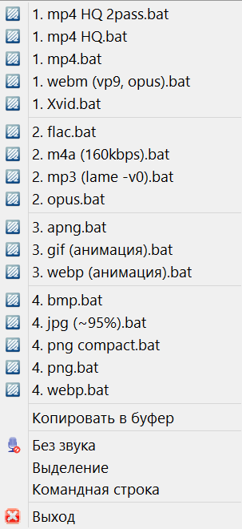
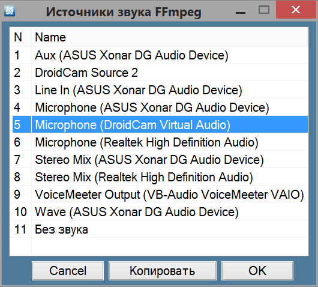
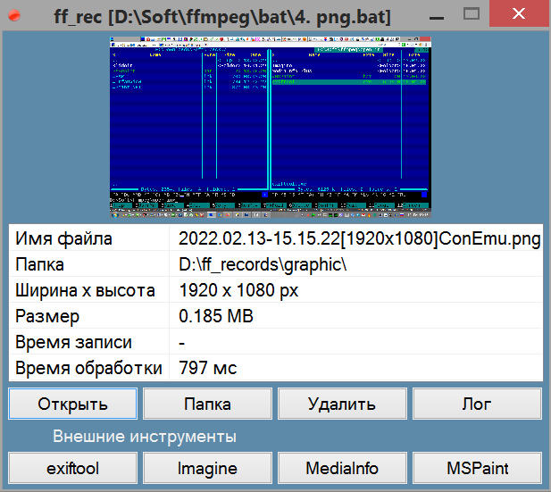

[Ветка форума ru-board (forum.ru-board.com)](http://forum.ru-board.com/topic.cgi?forum=5&topic=50455#1)

**ff_rec - утилита для записи экрана и снятия скриншотов с помощью FFmpeg под Windows**

Идея разработки появилась при использовании батников для записи экрана. Их неудобства очевидны: батник надо сворачивать и закрывать вручную, нет возможности быстрого выбора области экрана, ее масштабирования, выбора источника аудио, да и самого используемого батника. Программа решает все эти вопросы, добавляет множество других удобств и позволяет использовать все возможности FFmpeg для записи в самых разных форматах. Программа пригодна как для повседневного использования, так и для экспериментов.

Возможности:

- Меню из готовых батников в папке программы при запуске. Батники легко редактируемы и мало чем отличаются от стандартных, используемых для записи в *FFmpeg*. Есть большой набор готовых для использования или модификации
- Простое выделение требуемой области экрана, ее масштабирование с изменяемой кратностью изображения; быстрое выделение окон и контролов под курсором и подсветка выделенной области при записи 
- Выбор источника аудио или отключение звука из графического интерфейса программы
- "Тихий", без окна командной строки запуск батника и выход по горячей клавише или клику по иконке в трее
- Автоматическое сохранение вывода командной строки в файл, возможность увидеть его при записи в окне программы
- Окно завершения с быстрым доступом к файлу, его свойствам и просто настраиваемыми кнопками приложений, в которых он может быть открыт 
- Настраиваемая автоматическая сортировка выходных файлов по расширениям и автоматическое удаление промежуточных файлов
- Многозадачность: возможность параллельной записи с разных источников, снятия скриншотов во время записи и пр.
- Собственная командная строка для запуска из планировщика, менеджера горячих клавиш и пр.. Параметры генерируются программой автоматически при обычном выборе начальных параметров записи
- Полная портативность при размещении *FFmpeg* в каталоге программы

**Системные требования:** Windows XP - 11 (определяются используемой версией FFmpeg)

[TOC]

### Введение

Программа работает c FFmpeg находящимся в папке программы (портативный вариант) или в переменной *PATH*, если его там нет. При запуске программы происходит определение аудиоустройств средствами *FFmpeg*, и, в случае неудачи, выходит сообщение об его отсутствии или несоответствии версии системе. Если все в порядке, появляется меню:



Верхняя часть его представляет из себя ссылки на батники, находящиеся в папке *bat* программы. Они разбиты на группы (видео, аудио, анимация, графика) с помощью нумерации. Некоторые пояснения можно найти в них самих; их можно редактирвать, переименовывать, добавлять новые или удалять ненужные, чтобы не засорять меню. Ниже идет копирование экрана или выделенной области в буфер, выбор источника аудио и пункт *Выделение*, отметив который можно перейти к выделению необходимой области сразу после выбора батника. По умолчанию мы записываем или снимаем целый экран, о выделении немного позже. Меню *Командная строка* позволяет сгенерировать параметры, необходимые для запуска записи из внешнего приложения или скрипта.

При выборе батника начинается запись, о чем сообщает красная иконка в трее. Окно консоли при этом полностью скрыто. Время записи отображается на тултипе иконки в трее. Чтобы остановить запись, нажимаем клавишу **F9** или дважды щелкаем по иконке, при этом она исчезает и спустя небольшое время появляется окно завершения с информацией о записи и настроенными инструментами.

> В некоторых случаях, в батниках используется двух- и более проходное кодирование, поэтому появление этого окна может быть отсрочено. О том, что идет обработка сообщает свернутое окно консоли на панели задач!

Окно завершения сообщает о месте сохранения и позволяет открыть исполняемый файл или его папку. Принудительная остановка записи и связанной с ней процессов возможны из контекстного меню иконки или нажатием Ctrl+F9 (файлы, остающиеся в корне выходной папки, удаляются автоматически, если иное не прописано в настройках).

> Можно параллельно использовать несколько копий программы. При этом им соответствуют разные иконки в трее, различить которые можно по тултипу с временем записи, именем батника и источником звука. Клавиши F9 и Ctrl+F9 имеют общее действие, поэтому в этом случае придется использовать иконки в трее или их меню!

### Выделение областей экрана

Открывается при старте записи с отмеченным пунктом выделения в меню (что подтверждается дополнительно подсвеченным голубым цветом меню), либо при выборе батника с зажатым *Shift*. Появляется слегка подсвеченный экран выделенный по краям красной рамкой, что сделано для его быстрого масштабирования при необходимости. Слева над панелью задач находится индикатор примерно такого вида: `1920x1080 100% x2(+0.00)`. Здесь первые две цифры показывают ***выходное*** разрешение видео, 100% - текущий масштаб, х2 - кратность изображения (наименьший целый делитель размеров сторон), а цифра в скобках  - погрешность нарушения пропорций изображения из-за ee использования (определяется как разность масштабов по двум осям, выраженная в процентах - существенна, когда изображение невелико, а его кратность увеличена).

Если нас интересует конкретная область, мы можем выделять ее левой кнопкой мыши, при этом будет появляться подвижная красная рамка, а тултип у курсора мыши будет показывать текущее положение курсора и текущий размер области выделения. Повторять при необходимости это можно сколько угодно, индикатор над панелью задач при этом постоянно меняет свои показания. 

> Чтобы выделить окно, нажимаем на него левой кнопкой мыши с зажатым *Ctrl*, чтобы выделить контрол, кликаем по нему зажав *Shift*. Можно временно поднять чувствительность мыши или вернуть ее к исходной просто нажав *Alt* (соответствующее значение задается в *ff_rec.ini*). Если позволяют возможности, перед началом записи мышь находится у правого нижнего края выделения.

Инструкции вкратце описаны в тултипе, находящемся у центра верхнего края экрана (автоматически прячется при выделении). Для подтверждения выделения и начала записи нужно щелкнуть правой кнопкой мыши по выделенной области или нажать *Enter*. При желании всегда можно выйти щелкнув правой кнопкой вне выделения или нажав *Escape*. После начала захвата рамка немного увеличивается и меняет цвет на бледно голубой для индикации записи и выделения области захвата. 

#### Масштабирование выделения и изменение кратности

Самый простой способ, это просто прокрутить колесико мыши - масштаб будет меняться 10% скачками, о чем будет сообщать индикатор. Чтобы масштабировать по процентам, нужно зажать *Ctrl* при прокрутке колеса. Кроме того:

- Цифровые клавиши меняют масштаб на ее значение, умноженное на 10 (5 - 50% и т. д.)
- 0 сбрасывает масштаб на 100%
- Курсорные клавиши Вверх-Вниз меняют масштаб на 10%
- Те же клавиши с зажатым Ctrl - на 1%
- Курсорные клавиши Вправо-Влево  меняют кратность изображения по ряду 2, 4, 8, 16
- Backspace сбрасывает выделение, масштаб и кратность к начальным значениям

Нужна нестандартная кратность - пропишите в файле настроек (будет работать до изменения).

Все клавиши, кроме вышеперечисленных, передаются активному окну непосредственно.

> Кроме того, можно на время убрать полупрозрачный фон выделения (чтобы поправить положение окон и пр.) нажав клавишу *Tab*, а после вернуть его нажатием этой же кнопки. Имеющееся выделение при этом сохранится! О запущенном выделении говорит индикатор размера выделения; всегда можно закрыть программу по нажатию *Escape*. 
> В случае захвата/скриншота вебстраницы для ее подгонки и перемещения можно использовать серую клавиатуру и клавиши *Ctrl+=* и *Ctrl+-*.

Пункт меню *Копировать в буфер* просто копирует выделенный фрагмент без учета масштабирования и кратности.

### Выбор источника звука

Текущий отображается в меню, чтобы его изменить следует нажать на него. Появится окно:



Выбираем требуемый пункт, нажимаем OK и видим его отображенным во вновь появившемся меню. Источник сохраняется от запуска к запуску в конфигурационном файле *ff_rec.ini*. Если мы перенесли программу на другой компьютер и там нет такого источника, появится пункт *Без звука*. Можно скопировать название с помощью соответствующей кнопки или двойным кликом по соответствующей строке.
В каталоге программы можно найти файл *audio_devices.bat* для быстрого вызова того же окна.

### Окно завершения

Появляется по завершении записи:



Из него можно быстро открыть файл, его папку или удалить его. Открыть файл можно кнопкой *Открыть*, Нажатием кнопки *Enter* или просто двойным щелчком по изображению. Нижний ряд *Внешние инструменты* состоит из файлов и ярлыков программ, находящихся в папке *open_in* (о добавленном в нем в конце файла). Определяются lnk, bat, cmd, exe и ahk-файлы. Компактные простые программы с одним исполняемым файлом можно разместить прямо в ней, для остальных использовать батник или ярлык. Использованный батник отображается в заголовке. Закрыть окно можно нажатием кнопки *Escape.*

#### Консоль и лог

Кнопка *Лог* в окне завершения открывает текстовый вывод окна командной строки, что часто нужно в процессе отладки батников.

> Если при обработке произошла ошибка (ErrorLevel непуст), лог открывается автоматически после завершения!

В процессе записи, если необходимо, можно увидеть текущий вывод командной строки нажав клавишу *F8* или пункт контекстного меню иконки в трее. Сам файл сохраняется в конечной папке, есть опция для выключения его автоматического удаления по завершении.

### Создание батников записи

Размер, положение и выходные размеры области захвата, а также источник звука передаются батникам с помощью командной строки. С их же помощью передаются метки времени, имени окна и исполняемого файла активного приложения, нужные для генерирования уникального и наглядного имени файла.

#### Параметры командной строки, передаваемые батнику ####

-   %1 и %2 - отступы области захвата по горизонтали и вертикали от верхнего левого края экрана 
-   %3 - ширина и высота захватываемого участка, разделенные "x" (например, 800x600)
-   %4 - то же, но уже после масштабирования
-   %5 и %6 задают источник звука (два параметра из-за необходимости кавычек). Сочетание *%~5%6* посылает батнику строку вида `-f dshow -i audio="Microphone (Realtek High Definition Audio)"` при наличии источника и `-f lavfi -i anullsrc` при выборе опции *Без звука*.
-   %7 - момент начала записи в формате YYYY.MM.DD-hh.mm.ss
-   %8 - имя активного окна в момент начала записи (символы меняются на допустимые Windows, пробелы заменяются точками)
-   %9 - исполняемый файл (без расширения) активного в момент начала записи окна (при выделении контрола его имя добавляется в скобках)

#### Примеры использования

Можно просмотреть батники в папке *bat*, например простейший для png-скриншота (*FFmpeg* в папке программы автоматически добавляется в переменную PATH) :

```
ffmpeg -f gdigrab -draw_mouse 0 -offset_x %1 -offset_y %2 -video_size %3 -i desktop -vf scale=%4:flags=sinc -frames:v 1 %7[%4]%9.png
```

Здесь `-offset_x %1 -offset_y %2 -video_size %3` передает область захвата, а `-vf scale=%4:flags=sinc` его масштабирование. Простая запись в mp4 с использованием источника звука:

```
ffmpeg -f gdigrab -offset_x %1 -offset_y %2 -video_size %3 -i desktop %~5%6 -vf scale=%4:flags=lanczos -c:v libx264 -crf 23 -pix_fmt yuv420p -preset ultrafast %7_%9.mp4
```

Все как в обычных батниках, только цифровые значения заменены переменными, соответствующими параметрам командной строки. Навороты и сложности относятся к *FFmpeg*, а не к использованию самой программы.

#### Сохранение файлов и автосортировка

По умолчанию, файлы сохраняются в папке *ff-records*, находящейся в корне того же диска, с которого запущена программа (сделано для использования с флешки), но ее можно переопределить в *ff_rec.ini*. 

Как видно из батников, они не содержат никаких данных о пути, и файлы самых разных типов сохраняются в одну и ту же папку, что не есть хорошо. Прописывать подкаталоги в батниках тоже плохо, поскольку это сужает их функциональность, например, при использовании программы из планировщика. Поэтому сделано так:

1. В ff_rec.ini можно прописать подпапки и привязанные к ним расширения, по которым итоговый файл перемещается в одну из них по завершении кодирования, что делается при обычном использовании программы.
2. Если программа запускается из папки, не совпадающей с каталогом программы (а также папки cmd.exe, являющейся папкой выполнения командной строки по умолчанию), никакая автосортировка не производится и файл сохраняется в ней. Т. е. можно, например, создать ярлык программы, прописать в нем интересующую директорию запуска и выходные файлы окажутся там.

> Перемещение конечного файла в папку автосортиорвки происходит после завершения процеса кодирования. Промежуточные файлы, логи и эскизы (плюс файлы для отображения в окне завершения с префиксом *thumb_*) сохраняются в корневой папке, и до закрытия окна завершения и их можно просмотреть. В настройках есть опция, позволяющая не удалять все файлы или только логи кодирования. Можно удалять все выходные файлы при принудительном выходе по *Ctrl+F9* или меню *Выход*  в контекстном меню иконки в трее.

### Параметры командной строки

Можно использовать для создания ярлыков, батников и скриптов с некоторыми готовыми параметрами для ускоренного вызова, в том числе по горячим клавишам, а также для использования из планировщика. Пункт меню *Командная строка*, будучи отмеченным, позволяет сгенерировать выражение командной строки для данного батника, источника звука и параметров экрана, показывающихся и копирующихся в буфер (некоторые дополнительные параметры, вроде времени записи, придется ввести вручную, так же, как задать каталог запуска в скрипте или программе исполнения, если необходимо переопределить путь сохранения).

 Перечень параметров:

- "< имя батфайла >" - автоматический запуск батника. Прописывается или имя файла в папке *bat*, либо полный путь (сделано для возможности использования батников, не отражающихся в меню). Параметр должен стоять на первом месте, его отсутствие ведет к появлению меню
- -i < имя источника звука > - выбор источника звука (например, *-i "Microphone (Realtek High Definition Audio)"*). Выражение `-i 0` соответствует записи без звука (источник *-f lavfi -i anullsrc*). Отсутствие параметра ведет к использованию источника из *ff_rec.ini.* Использование параметра не влияет на сохраненный в параметрах последний источник звука. При генерации из программы присутствует только в случае наличии источника звука в батнике!
- -s - автоматическое включение выделения. Если сочетается с параметрами, определяющими выделение, выводится подсветка соответствующей области, так что добавление этого параметра может быть использовано при отладке
- -show < dd > - отображение области выделения и окна завершения. Если цифровое значение равно 0, это скрытый режим, без подсветки рабочей области, окна завершения и уведомления в трее при принудительном завершении по Ctrl+F9. В случае ненулевого значения - автоскрытие окна завершения через соответствующее значение секунд (простое подтверждение сделанного скриншота и пр.)
- -t dddd - время записи, в секундах
- -info - вывод информации об аудиоустройствах
- -x < ddd > - отступ области выделения по x
- -y < ddd > - то же по y
- -w < ddd > - ширина области выделения
- -h < ddd > - ее высота
- -z < dd > - масштаб (*-z 50* - масштаб 50%)
- -< dd > - кратность изображения (*-8* - кратность 8)

Параметры, задающие область записи по умолчанию, если пропущены (все или частично), соответствуют всему экрану без масштабирования и с кратностью равной двум!

Простейшее - запуск батника для скриншота с включенным выделением:

```
ff_rec.exe "4. png compact.bat" -s
```

Cкриншот центральной области с масштабом, кратностью и двухсекундным показом окна завершения:

```
ff_rec.exe "4. png compact.bat" -x 400 -y 200 -w 1100 -h 600 -z 60 -4 -show 2
```

Минутная запись звука без окна завершения:

```
ff_rec.exe "2. flac.bat" -f dshow -i audio="Microphone (Realtek High Definition Audio)" -t 60 -show 0
```

Несколько примеров использования в Autohotkey (горячие клавиши с автосортировкой по разным признакам):

```
SetWorkingDir %A_ScriptDir%

; Скрипт толжен находится в папке приложения!

; Простой запуск по PrintScreen
PrintScreen::Run ff_rec.exe, < папка сохранения >

; Скриншот по Ctrl+PrintScreen в папку (задается через папку запуска) с автосортировкой по датам, включенным выделением и кратким показом результата
^PrintScreen::
	dir:="D:\Screenshots\" A_YYYY "-" A_MM "-" A_DD
	FileCreateDir % dir
	Run ff_rec.exe "4. png.bat" -s -show 2, % dir
	Return
	
; То же по Win+PrintScreen с сортировкой по исполняемым файлам активного окна
#PrintScreen::
	WinGet pr, ProcessPath, A
	SplitPath pr,,,, name
	dir:="D:\Screenshots\_Apps\" name
	FileCreateDir % dir
	Run ff_rec.exe "4. png.bat" -s -show 2, % dir
	Return
	
; То же по Shift+PrintScreen с сортировкой по именам открытых в браузере сайтов
+PrintScreen up::
	KeyWait Shift
	Send ^{vk4C}
	Sleep 200
	Send {Esc}
	Clipboard:=""
	Send ^{vk43}
	ClipWait 0.5
	RegExMatch(Clipboard, "://(www\.)?\K\S+?(?=(/|$))", site)
	If !site
		Return
	dir:="D:\Screenshots\_Sites\" site
	FileCreateDir % dir
	Run ff_rec.exe "4. png.bat" -s -show 2, % dir
	Return

```


### Внешние инструменты

В папке *open_in* находятся (и отображаются в окне завершения):

- MediaInfo Plus - информация о медиафайлах и изображениях
- exiftool - то же, больше для изображений
- Imagine - компактный просмотрщик графики
- Ярлык для Microsoft Paint

### Рекомендуемые программы

- [IrfanView](https://www.irfanview.com/) -  просмотрщик графики, apng- и webp- анимации (требуются плагины)
- [Screen capture recorder](https://github.com/rdp/screen-capture-recorder-to-video-windows-free) - запись звуков рабочего стола (добавляет свой источник звука)
- [Voiceemeter](https://vb-audio.com/Voicemeeter/) - замена стандартному Stereo Mix микшеру Windows, позволяет настраиваемо накладывать различные источники звуков (источник звуков с настрйками в Панели управления - Звуки)
- [PxKeystrokesUi](https://giters.com/ming86/PxKeystrokesForScreencasts) - отображение нажатий мыши и клавиатуры, подсветка указателя 
- [Sysinternals Zoomit](https://docs.microsoft.com/en-us/sysinternals/downloads/zoomit) - быстрое масштабирование экрана и рисование на нем
- [DemoHelper](https://github.com/stefankueng/demohelper/releases/tag/2.1.0) - комбинация того и другого
